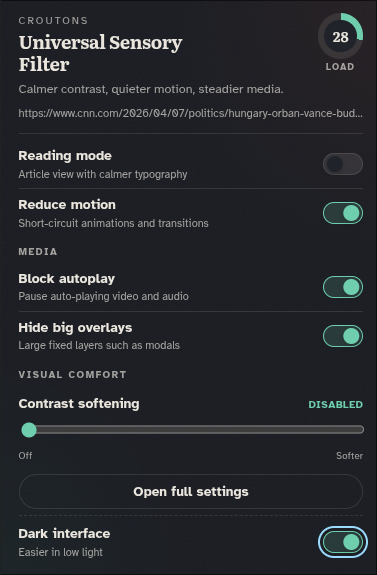
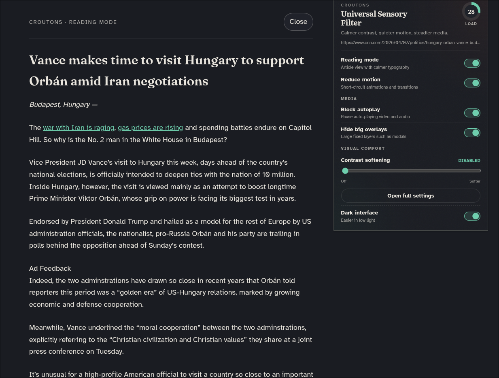
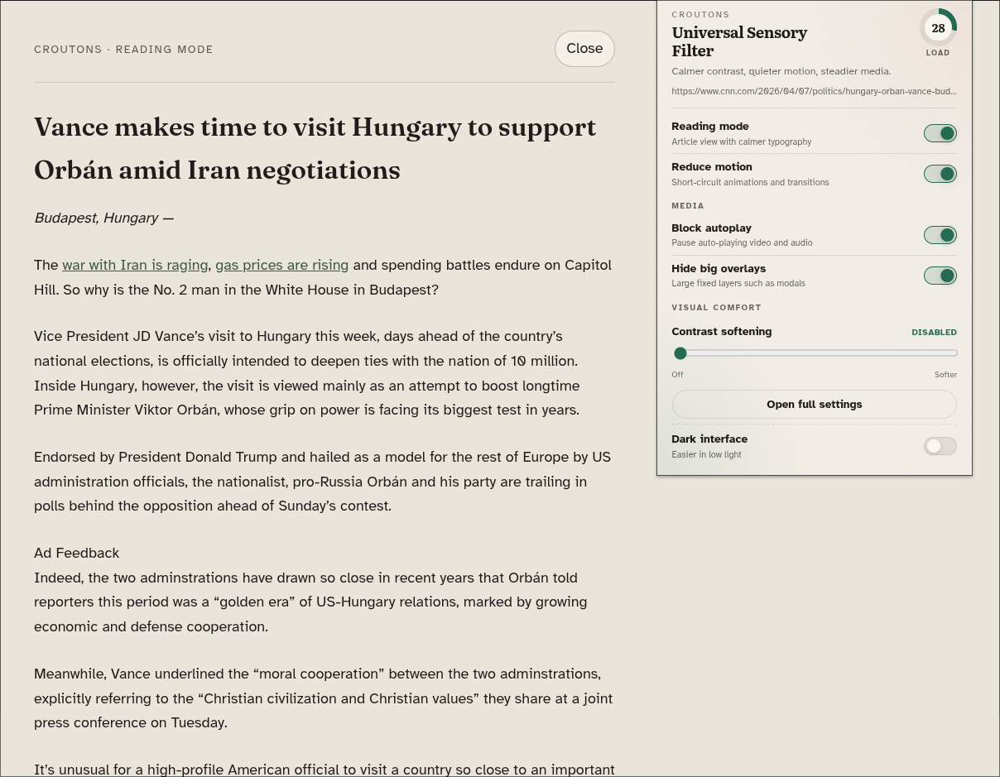

# Universal Sensory Filter (Croutons)

A Chrome extension that makes busy pages easier to process: **softer contrast**, optional **grayscale**, **less motion**, **no autoplay**, optional **overlay reduction**, and **reading mode** powered by Mozilla Readability. Everything runs **in the browser**—no accounts and no server.

Built with [Plasmo](https://docs.plasmo.com/), React, and TypeScript.

---

## Screenshots

**Extension popup (dark theme)** — sensory load score and quick controls.



**Reading mode (dark theme)**



**Reading mode (light theme)**



---

## Features

- **Contrast & motion** — Reduce visual harshness and optional animation for a calmer screen.
- **Grayscale mode** — Convert the page to black and white for lower color stimulation.
- **Autoplay control** — Block autoplaying media where the page allows it.
- **Overlays** — Optionally hide large fixed overlays that compete for attention.
- **Reading mode** — Strip clutter and focus on article text (Mozilla Readability).
- **Weighted cognitive load score** — Compute a page load score from weighted page signals (motion, autoplay, media density, overlays, and color complexity).
- **Color load analysis** — Analyze on-page color characteristics (contrast harshness, saturation, hue spread, and color fragmentation) and include them in the total load score.
- **Adaptive recommendation engine** — Recommend useful filters based on current load.
- **Auto grayscale trigger** — Automatically enables grayscale when color load exceeds 60.
- **Before/after score reduction** — Show baseline load, filtered load, and how much the extension reduced.

Restricted URLs (`chrome://`, the Chrome Web Store, and similar) do not run content scripts; test on normal `https://` pages.

---

## Development

```bash
npm install
npm run dev
```

Load the unpacked extension in Chrome: **Extensions → Developer mode → Load unpacked** → choose `build/chrome-mv3-dev` for development, or `build/chrome-mv3-prod` after a production build.

Reload the extension on `chrome://extensions` when you change code (unless you rely on dev HMR).

## Production build

```bash
npm run build
npm run package
```

## Suggested workflow

1. Open a content-heavy site (news, shopping, feeds).
2. Open the toolbar popup: review the **weighted load score**, **color load**, and **reduction** (`base → current`) while adjusting toggles.
3. On articles, try **Reading mode**.
4. Open **Thresholds & details** for the full options page.

---

## Project layout

| Path | Role |
|------|------|
| `popup.tsx` / `popup.css` | Toolbar popup |
| `options.tsx` / `options.css` | Full-page options |
| `contents/sensory.ts` | Page filters, score, reading mode |
| `lib/settings.ts` | `chrome.storage.sync` schema |

---

## Team

**Croutons** — accessible computing project.
